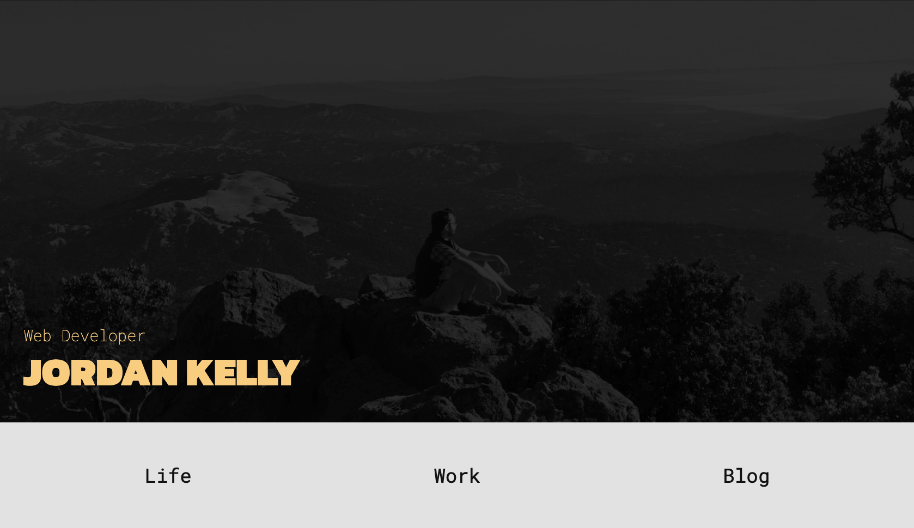
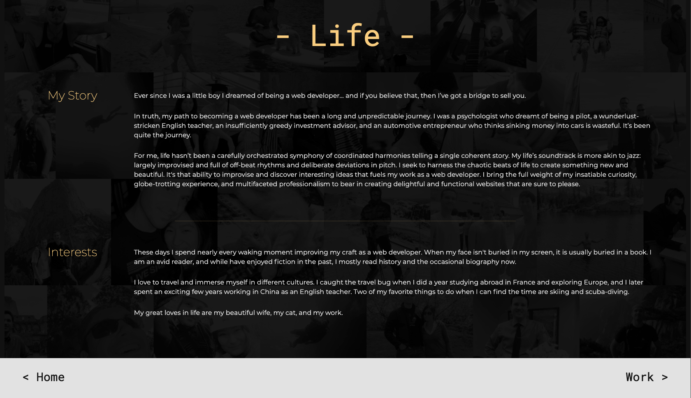
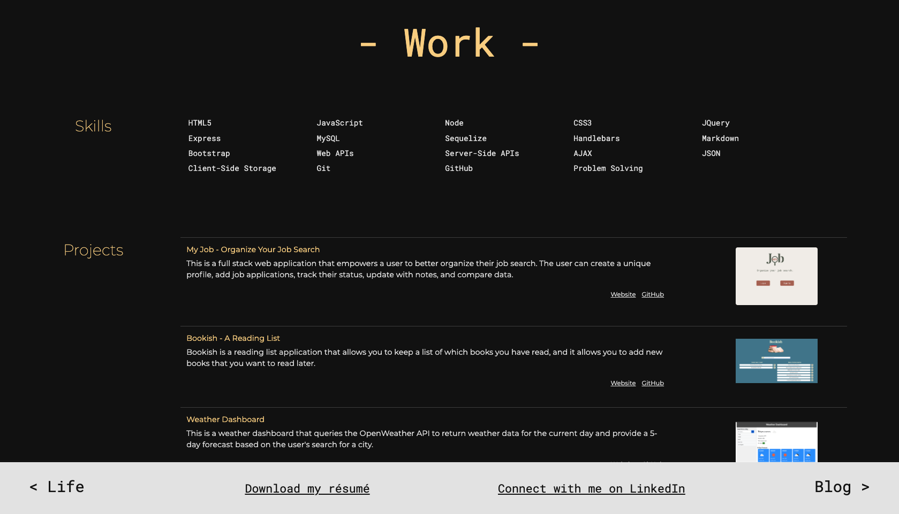

# Professional Portfolio

## Table of Contents
* [Project Summary](##project-summary)
* [Technologies Used](##technologies-used)
* [How to Access](##how-to-access)
* [About Me](##about-me)
* [Screenshots](##screenshots)
---

## Project Summary
This is my professional website. It has pages to introduce visitors to my life and work, and there is a blog page that I plan to begin soon. The work page is created using project data stored in a remote database.

## Technologies Used
* [JavaScript](https://developer.mozilla.org/en-US/docs/Web/JavaScript)
* [HTML5](https://developer.mozilla.org/en-US/docs/Web/Guide/HTML/HTML5)
* [CSS3](https://developer.mozilla.org/en-US/docs/Archive/CSS3)
* [MySql](https://www.mysql.com/)
* [Sequelize](https://sequelize.org/)
* [Express](https://expressjs.com/)
* [Handlebars](https://handlebarsjs.com/)

## How to Access
[Portfolio Webpage](https://profjjk.github.io/portfolio/)

## About Me
* [LinkedIn](www.linkedin.com/in/the-real-jordan-kelly)
* [GitHub](https://github.com/profjjk)

## Screenshots

